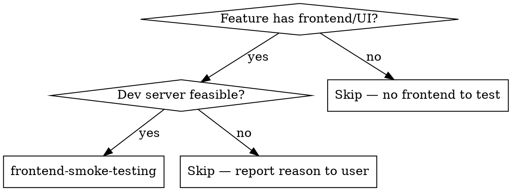
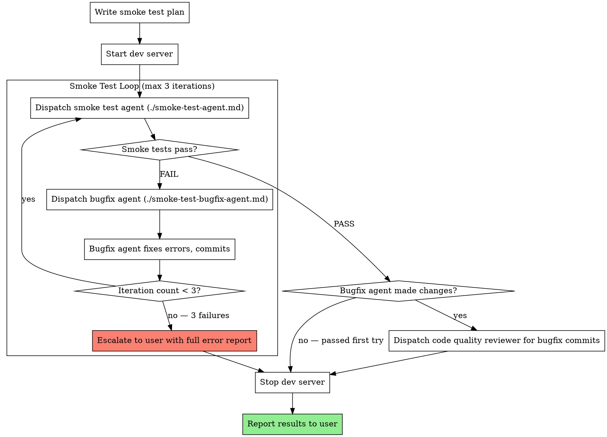

# Frontend Smoke Testing

Automates the manual "open the app and click around" workflow. Two-agent architecture: a smoke test agent uses Playwright to walk through scenarios and report errors, a bugfix agent reads the errors and fixes them. Max 3 fix-and-retry loops before escalating to the user.

**Why automate this:** About half the time after implementation, the page has errors — missing imports, wrong props, broken routes, hydration mismatches. Catching these before claiming "done" saves a round-trip with your human partner.

**Core principle:** The app must actually work in a browser before you call it done.

## When to Use

After implementation of a feature that has frontend/UI work. Before claiming "done." Invoked automatically by subagent-driven-development after all tasks complete and final code review passes.

## When to Skip

- No frontend in the feature (backend-only, CLI tool, library)
- No dev server feasible (static library, no `dev` script, build-only project)
- Dev server requires environment config not available locally (third-party API keys, production databases, external services)
- User explicitly says to skip

If skipping, **always tell the user why** and what manual testing they should do instead.

## The Process

### Step 1: Write Smoke Test Plan

Analyze what was built by reading the spec, plan, and implementation code. Write comprehensive scenarios split into two sections:

**a. Testable locally** — Pages to visit, interactions to perform, expected results. Only things feasible on localhost with Playwright. Be specific: URLs, click targets, form inputs, expected text/elements.

**b. Requires manual testing** — Scenarios needing production environment, third-party services, special config, or complex harnessing. Include WHY each cannot be tested locally.

Save to: `docs/supernova/<feature-folder>/smoke-tests.md`

**Never skip this step.** Writing the plan forces you to think about what "working" means before touching the browser.

### Step 2: Start Dev Server

Auto-detect how to run the dev server from the project:

1. Check `package.json` for `dev`, `start`, or `serve` scripts
2. Check for `Makefile`, `docker-compose.yml`, or other runner configs
3. Common patterns: `npm run dev`, `yarn dev`, `pnpm dev`, `next dev`

Start the server and wait for it to be ready:
- Watch stdout for "ready", "listening", "started", "compiled" signals
- Or poll the URL until it responds

**If no dev server can be detected or started:** Stop here. Report to user with the reason and what manual testing they should do. Do not proceed to smoke testing.

### Step 3: Smoke Test Loop (max 3 iterations)

**a. Dispatch fresh smoke test agent** (`./smoke-test-agent.md`)
- Input: path to `smoke-tests.md`
- Agent uses Playwright to walk through all "Testable locally" scenarios
- Agent writes results to `docs/supernova/<feature-folder>/smoke-test-results.md` (overwritten each run — always reflects current state)
- Agent returns: **PASS** or **FAIL**

**b. If PASS:** Break loop, proceed to Step 4.

**c. If FAIL:** Dispatch fresh bugfix agent (`./smoke-test-bugfix-agent.md`)
- Input: paths to `smoke-test-results.md` + `smoke-tests.md` + `plan.md`
- Agent reads source files referenced in stack traces and errors
- Agent fixes errors and commits
- Agent returns: summary of fixes
- Loop back to (a) with a fresh smoke test agent

**d. If 3 failures:** Stop the loop. Proceed to Step 5 (stop dev server), then escalate to user with the full error report and a summary of what was attempted across all iterations. The bugfix agent should use `supernova:systematic-debugging` if it encounters issues it cannot resolve through straightforward fixes.

### Step 4: Post-Fix Code Review (conditional)

If the bugfix agent made code changes during the loop:
- Record the base SHA (before first fix) and head SHA (after last fix)
- Dispatch a code quality reviewer scoped to just those bugfix commits
- Provide the spec and plan as context so the reviewer understands the feature
- Use the same `code-quality-reviewer-prompt.md` from subagent-driven-development

If smoke tests passed on first try (no fixes needed): skip this step entirely.

After review completes, proceed to Step 5. No need to re-run smoke tests after review.

### Step 5: Stop Dev Server

Kill the dev server process. Always. Even on failure. Even on escalation.

Report results to the user:
- Which scenarios passed
- Which scenarios failed (if any remain)
- What the bugfix agent changed (if anything)
- Which scenarios require manual testing and why

## Agent Prompts

- `./smoke-test-agent.md` — Dispatched to run Playwright-based smoke tests against localhost
- `./smoke-test-bugfix-agent.md` — Dispatched to read smoke test failures and fix the code

## Red Flags

**Never:**
- Skip the smoke test plan writing step (Step 1 forces you to define "working")
- Claim "done" if smoke tests haven't passed (or been explicitly skipped with reason)
- Run more than 3 fix iterations without escalating to the user
- Leave the dev server running after completion (success or failure)
- Let the bugfix agent make sweeping refactors (it fixes errors, nothing more)
- Trust that "it compiled" means "it works in the browser"
- Skip the post-fix code review when bugfix changes were made
- Dispatch smoke test agent without a written smoke test plan

## Integration

**Called by:**
- **supernova:subagent-driven-development** — After all tasks complete and final code review passes, before finishing-a-development-branch

**Uses:**
- **supernova:systematic-debugging** — Escalation path when bugfix agent encounters issues it cannot resolve through straightforward fixes
- **subagent-driven-development/code-quality-reviewer-prompt.md** — For post-fix code review of bugfix commits

**Followed by:**
- **supernova:finishing-a-development-branch** — After smoke tests pass (or are explicitly skipped)
